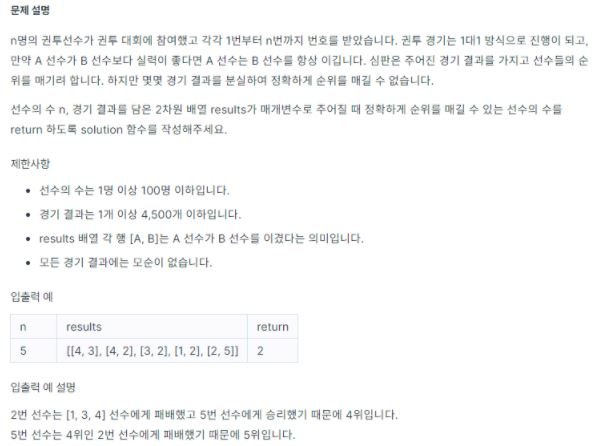

[](https://programmers.co.kr/learn/courses/30/lessons/49191)

## 풀이방법
 - return 해야하는 수: 정확하게 순위를 매길 수 있는 선수의 수
 
 -> 정확하게 순위를 매길 수 있을 경우를 알아 내야 한다.
 
 
 
 - 입출력 예 에서 알 수 있는 것 2가지
   1. 어떤 선수 A가 B를 이겼으면 B가 이긴 선수들은 A가 이긴다.
   
   2. 어떤 선수 A가 C한테 졌으면 C를 이긴 선수들은 A도 이긴다.
   
   
  - 플로이드 알고리즘의 사용.
  
  플로이드 알고리즘: 모든 정점사이의 최단 비용를 찾는 알고리즘.
 
 정점과 정점사이의 최단 비용을 찾는데, k 노드를 경유하였을 때 그 값이 현재 최솟 값보다 작으면 갱신 시키며 행렬을 만드는 알고리즘 이다.
 
    - `순위` 문제는 비용이 있는 그래프가 아니기 때문에, 값을 매기기 힘들지만,
    
    A가 B를 이겼다고 가정했을 때, 이렇게 행렬식을 먼저 만들어놓는다. `(K = 0)`
    `[기본 행렬의 원소 =>  0]`
    
    `matrix[A][B] = 1, matrix[B][A] = -1`
    
    - 플로이드 워셜을 탐색할 때, `K` 노드를 경유할 때, `현재 탐색하는 A(ROW) 노드가` `현재 경유하는 K 노드` 한테 이겼으면, `[K][B] = 1` 인 것들은 `[A][B] = 1, [B][A] = -1` 을 의미한다.
    
    - 이렇게 모두 갱신을 시키고나면, 0이 아닌 `1, -1`이 `n-1개` 가 있으면 그 선수의 정확한 순위를 매길 수 있다.
    
    
    
---
    

```py
def solution(n, results):
    matrix = [[0 for _ in range(n)] for _ in range(n)]
    results = [[x-1, y-1] for x, y in results]
    
    for winner, loser in results:
        matrix[winner][loser] = 1
        matrix[loser][winner] = -1
        
    for k in range(n):
        for row in range(n):
            for col in range(n):
            	if row != col and matrix[row][col] == 0 and matrix[col][row] == 0:
                    if matrix[row][k] == 1 and matrix[k][col] == 1:
                        matrix[row][col] = 1
                        matrix[col][row] = -1
                    if matrix[row][k] == -1 and matrix[k][col] == -1:
                        matrix[col][row] = 1
                        matrix[row][col] = -1
    
    
    return len([y for y in [len([x for x in matrix[i] if x != 0]) for i in range(len(matrix))] if y == n - 1])
    
```